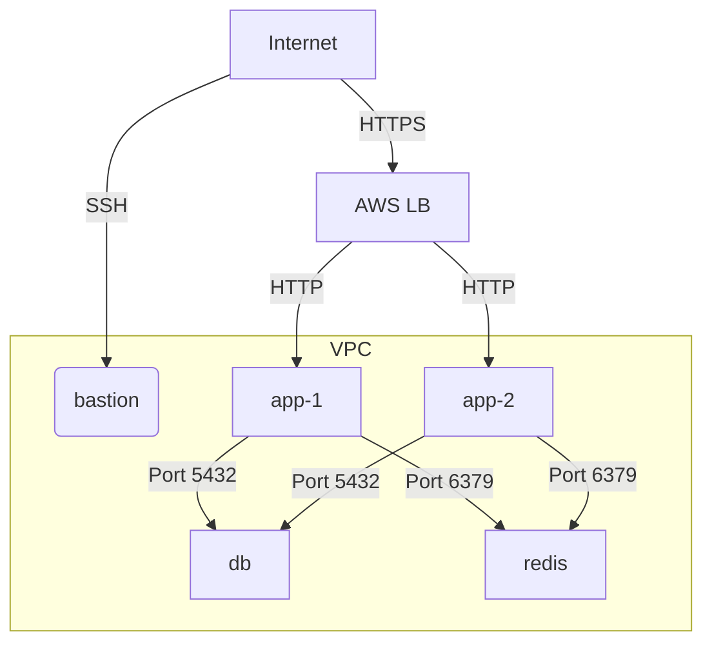

# Counter - Infrastructure Repo

This repo holds Terraform and Ansible files that are used to create and configure DNS records and services for the Counter app.

* Backend can be stored in Terraform Cloud
* Sample variables file included

## Server Layout

1. Internet goes to AWS Load Balancer (AWS-LB)
2. AWS-LB has SSL certificate and does SSL termination.
3. AWS-LB points to app servers
  * Checks `/up` endpoint
4. nginx reverse proxies to Puma
5. app server serve Ruby/Rails over Puma

## Services
### Application
* Ruby on Rails
* [Terraform](webservers.tf)
* [Config](ansible/roles/app)

### Database
* Postgresql database
* [Terraform](databases.tf)
* [Config](ansible/roles/database)

### Redis
* User config stored in [config/redis_users.acl]
* [Terraform](webservers.tf)
* [Config](ansbile/roles/redis)

### Loadbalancer
* AWS Loadbalancer
* SSL Termination and forward to nginx server
* [Terraform](loadbalancer.tf)

### Nginx
* [Terraform](webservers.tf)
* [Config](ansible/roles/nginx)